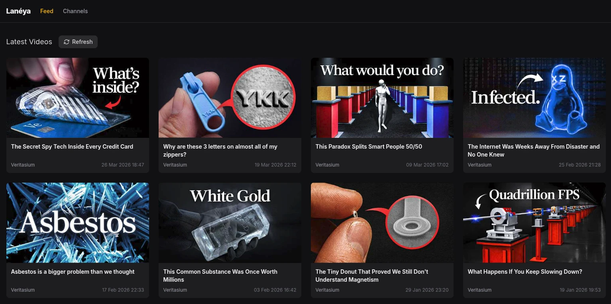
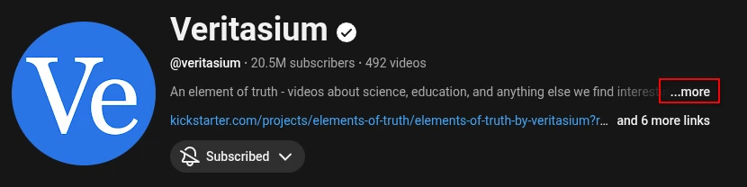
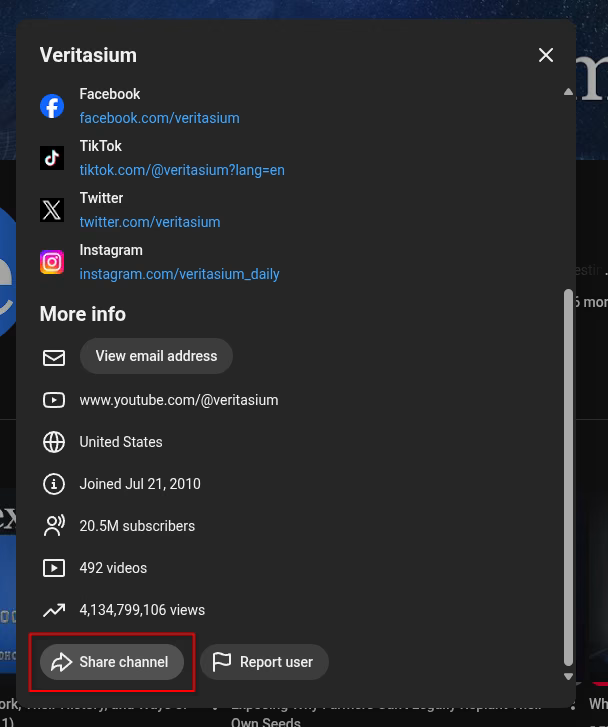
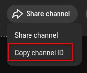
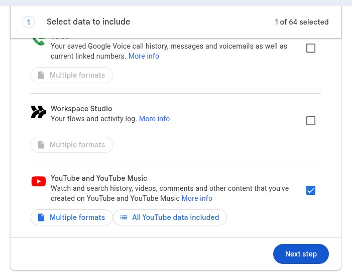
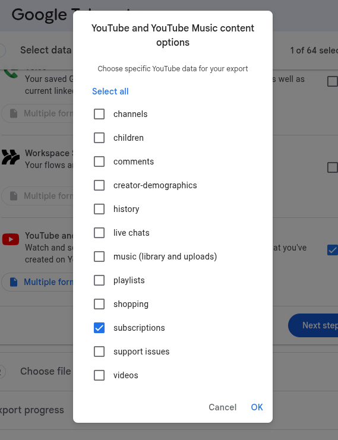

# Laneya

> Self-hosted YouTube subscription follower and notification system

<div align="center"></div>

## Name definition

**lanéya** - Quenya _adverb._ recently, not long ago

| Element | Gloss                                |
|---------|--------------------------------------|
| `la-`   | "not, in-, un-; [ᴹQ.] none, not any" |
| `néya`  | "once, at one time"                  |

[Source](https://www.elfdict.com/w/laneeya?include_old=1)

---

## Features

- Tracks YouTube channels via their public RSS feeds - no API key required
- Real-time new-video notifications via WebSocket
- Bulk import channels from a **Google Takeout** CSV export
- Single-container Docker deployment with a persistent SQLite database
- Built with Rust ([Axum](https://github.com/tokio-rs/axum)), [HTMX](https://htmx.org)
  and [Tailwind CSS v4](https://tailwindcss.com)

---

## Deploying with Docker

```yaml
services:
  laneya:
    image: ghcr.io/Akasiek/laneya:latest
    restart: unless-stopped
    ports:
      - "8080:8080"
    volumes:
      - laneya_data:/data

    environment:
      # Timezone for videos timestamps
      TZ: "UTC"
      # Set to true to skip YouTube Shorts
      FILTER_OUT_SHORTS: "true"
      # Number of videos to show per page
      VIDEOS_PER_PAGE: "24"
      # How often to fetch new videos from YouTube
      FEED_REFRESH_INTERVAL_MINS: "5"

    read_only: true
    security_opt:
      - no-new-privileges:true
    cap_drop:
      - ALL # Drop all Linux capabilities. The application doesn't need any special permissions.

volumes:
  laneya_data:
```

Save the above as `compose.yaml`, then run:

```bash
docker compose up -d
```

The app will be available at **http://localhost:8080**.

Data is stored in the `laneya_data` Docker volume which can be changed if needed.

### Environment variables

| Variable                     | Default        | Description                                |
|------------------------------|----------------|--------------------------------------------|
| `HOST`                       | `0.0.0.0:8080` | Address and port the server listens on     |
| `TZ`                         | `UTC`          | Timezone used for video timestamps         |
| `FILTER_OUT_SHORTS`          | `false`        | Set to `true` to hide YouTube Shorts       |
| `VIDEOS_PER_PAGE`            | `24`           | Number of videos displayed per page        |
| `FEED_REFRESH_INTERVAL_MINS` | `5`            | How often (in minutes) feeds are refreshed |

### Container security

- The container runs as a non-root system user with no home directory and no login shell
- The container filesystem is read-only - only the `/data` volume can be written to
- All Linux capabilities are dropped
- `no-new-privileges` is enforced - the process cannot gain elevated privileges via setuid/setgid binaries
- Multi-stage Docker build - the runtime image contains only the compiled binary and static assets; no compiler, build
  tools, or source code

---

## Adding channels

### Single channel

You need the **channel ID** - a string starting with `UC` (e.g. `UCXuqSBlHAE6Xw-yeJA0Tunw`).

Way to find it:

1. On the channel page click **...more** \
   
2. Scroll to the very bottom of the modal and click **Share channel** \
   
3. Click **Copy channel ID** \
   
4. Paste the ID into the form on the **Channels** page and submit

### Bulk import via Google Takeout

1. Go to [Google Takeout](https://takeout.google.com)
2. Deselect all products, then scroll down and select only **YouTube and YouTube Music** \
   
3. Click **All Youtube data included** and make sure only **subscriptions** is selected \
   
4. Click **Next step**, then choose your delivery method and export frequency, and click **Create export**. Export
   should take about a minute.
5. Inside the downloaded archive find `YouTube and YouTube Music/subscriptions/subscriptions.csv`. This should be the
   only file in that archive.
6. Upload that file using the **Bulk Import** form on the Channels page

---

## Development

### Prerequisites

- [Rust](https://rustup.rs) (stable)
- [systemfd](https://github.com/mitsuhiko/systemfd) (if you want to use the hot-reload server)
- [pnpm](https://pnpm.io)
- [diesel_cli](https://diesel.rs/guides/getting-started)

### Setup

#### `.env` file

Create a `.env` file in the project root with the following content:

```env
DATABASE_URL=./database.db
```

#### Install dependencies and apply database migrations

```bash
# Install JS dependencies
cd templates && pnpm install && cd ..

# Apply database migrations
diesel migration run
```

### Running the server

With hot-reload (restarts server on code changes):

```bash
systemfd --no-pid -s http::8080 -- cargo watch -x run
```

or without hot-reload:

```bash
cargo run
```

### Tailwind CSS watch

In a separate terminal from the `templates/` directory:

```bash
cd templates && pnpm run watch:css
```

Watches `styles/styles.css` and rebuilds `styles/tailwind.css` on every change.

### Database migrations

```bash
# Apply pending migrations
diesel migration run

# Revert the last migration
diesel migration revert
```
